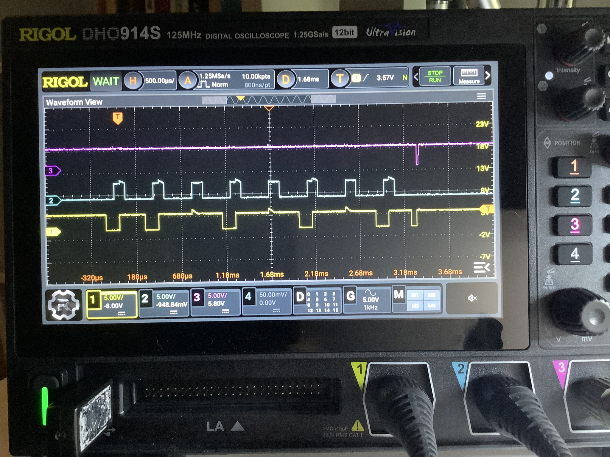

TRS80-Model II keyboard emulator from arduino

* TRS80-Moel II Keyboard Timing Diagram:

---

Keyboard Timing Diagram - Capture from a TRS-80 Model II keyboard:

---

Keyboard Timing Diagram - Capture from the arduino PS2 keyboard emulator:

